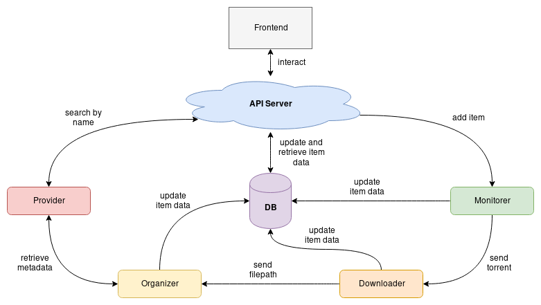

# Godarr
Golang reimplementation of Radarr

## Concept
Godarr's backend will be interacted with using a REST API.  
The different tasks of acquiring data and processing it will be
separated into services.

##### API Server
Serve item data and accept commands from a client.

##### Provider
Responsible for getting item metadata and unique identifiers, e.g.
from platforms such as TVDb and TMDb.

##### Monitorer
Used to monitor (hence the name) availability of items added by the
user and providing download links to torrent files.

##### Downloader
Downloads files from a torrent files and save them to a location

##### Organizer
Rename and move/link files and create directory structures to
normalize representation of items in the filesystem

